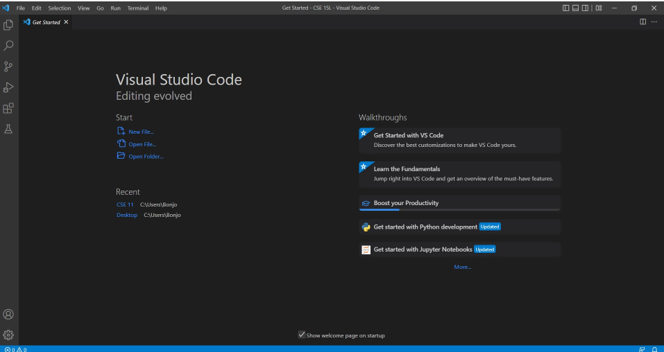
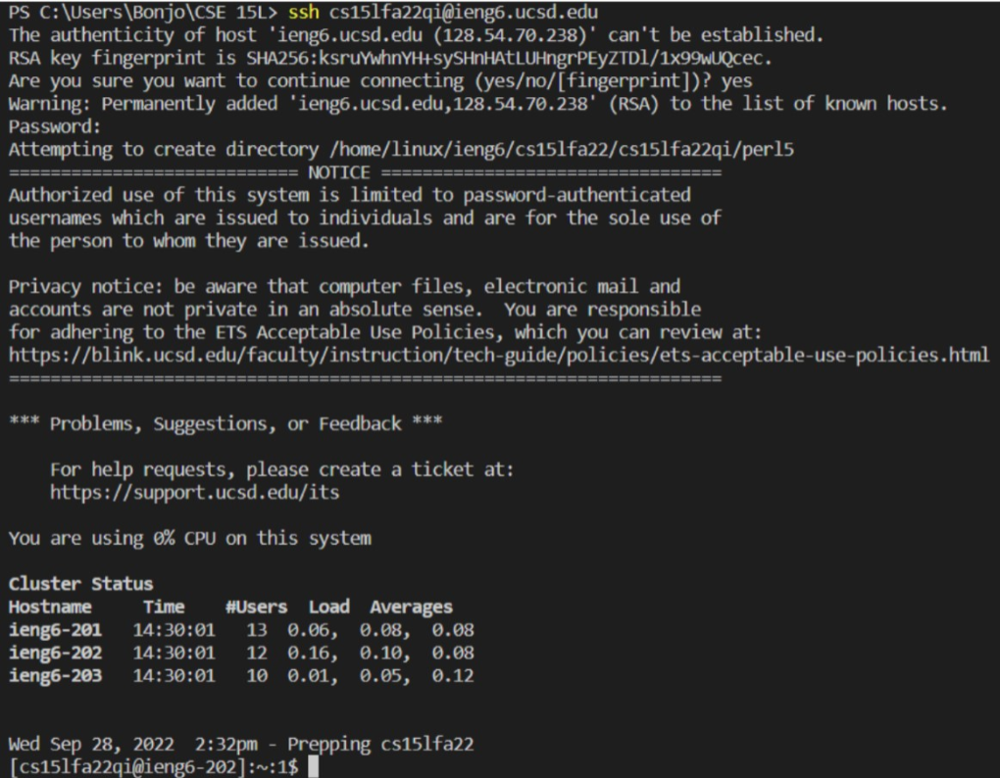
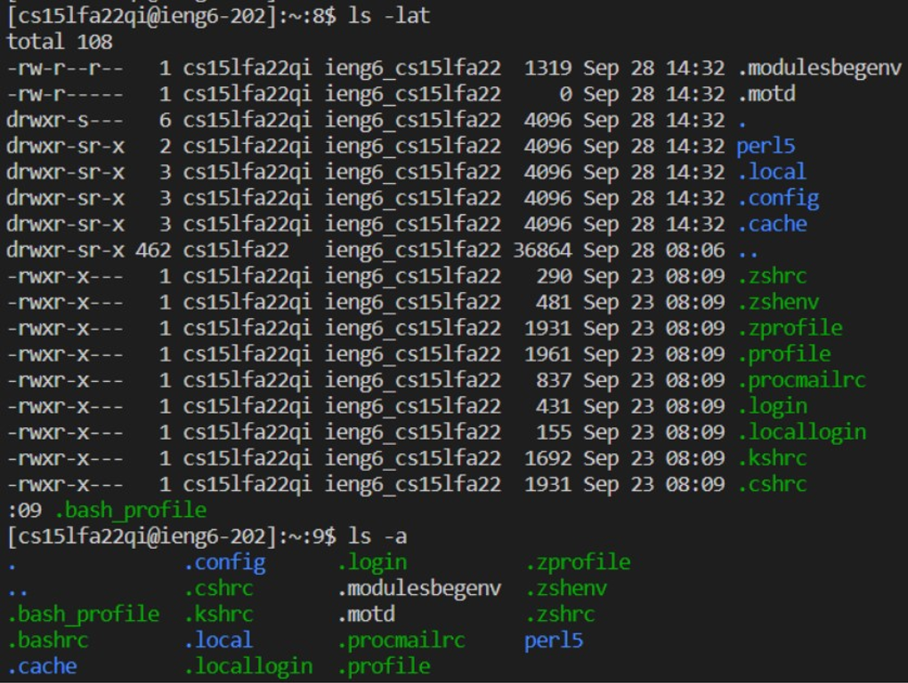
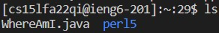
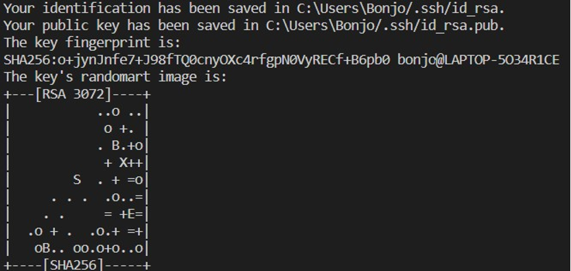
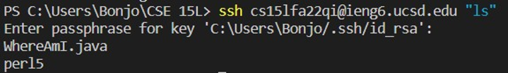

## Part 1: Downloading VSCode
1. To download VSCode go to this link: [VSCode Download](https://code.visualstudio.com/)
2. Choose the correct version for your desktop or laptop
3. Click download and open it after it has finished
4. It should look something like this:

## Part 2: Remotely Connecting
1. Download OpenSSH client from: [OpenSSH](https://docs.microsoft.com/en-us/windows-server/administration/openssh/openssh_install_firstuse)
2. Get your username, the username for everyone in CSE 15l is cs15lfa22## (the ## is your personal identifier), find it here: [link](https://sdacs.ucsd.edu/~icc/index.php)
3. Once at that link and you have your username, now we have to change your password (it automatically gives you a randomly assigned one)
4. Now that you've done all that open VSCode again and open the terminal and type in your user name followed by @ieng6.ucsd.edu so that it looks like: cs15lfa22##@ieng6.ucsd.edu
5. It should prompt you for your password, enter it (don't worry that it's not showing up, you're still typing it in)
6. After you've input your password it should look something like this: 

## Part 3: Trying Some Commands
1. Try running some of these commands on the remote computer and see what they do: cd, ls, pwd, mkdir, and cp (here's an example: of ls -lat 
2. After you've done that and hopefully taken some notes log out of the remote computer by either typing in exit or Ctrl-D
3. Now try again on your home computer and take note of any similarities

## Part 4: Moving files with scp
1. To move a file from your local computer to a remote computer, you first need to log out of the remote computer (type exit in the terminal or Ctrl-D)
2. Now that you are back in you local computer, choose a file you want to copy into the remote computer
3. Then, in the directory of this file, put this command into the terminal: **scp FileName.java cs15lfa22##@ieng6.ucsd.edu:~/**
4. It will prompt you for your password, enter it
5. Now log back into the remote computer and check that the file you moved to it is there by using the **ls** command, and it should look something like this(I moved a file called WhereAmI.java): 

## Part 5: Setting an SSH key
1. Log out of the remote computer
2. Use the command **ssh-keygen** in the terminal where you should get a message that tells you it is creating a public/private key pair and prompt you to decide where to store them, just press enter, it will automatically put the keys into the file shown
3. It should prompt you for a passphrase now, put on in
4. After inputting a passphrase you should get something that looks like this: 
5. After you have done this type this command into the terminal: **scp (the file your public key has been saved in) cs15lfa22##@ieng6.ucsd.edu:~/.ssh/authorized_keys**
6. Now try to login again using your passphrase

## Part 6: Optimizing Remote Running
1. Using the up arrow can save you time so you type less, as it can let you acces previous terminal commands
2. You can run commands in the remote computer from your computer by following this format: **ssh cs15lfa22##@ieng6.ucsd.edu "[command]"**(ex. 
3. You can run multiple commands in the terminal by separating them by semicolons
