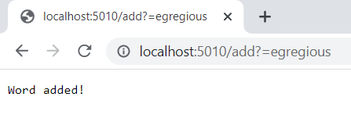
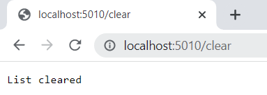
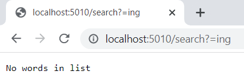

        import java.io.IOException;
        import java.net.URI;
        import java.util.ArrayList;

        class Handler implements URLHandler {
            // The one bit of state on the server: a number that will be manipulated by
            // various requests.
            ArrayList<String> a = new ArrayList<>();
            public String handleRequest(URI url) {
                if (url.getPath().equals("/")) {
                    return String.format("String engine");
                } else if (url.getPath().equals("/add")) {
                    a.add(url.getQuery().split("=")[1]);
                    return String.format("Word added!");
                } else {
                    System.out.println("Path: " + url.getPath());
                    if (url.getPath().contains("/search")) {
                        String[] parameters = url.getQuery().split("=");
                        String WordsInString = "";
                        for(String c:a){
                            if(c.contains(parameters[1])){
                                WordsInString = WordsInString + c + ",";
                            }
                        }
                        return String.format(WordsInString.substring(0,WordsInString.length() - 1));
                    }
                    else if(url.getPath().contains("/clear")){
                        a.clear();
                        return String.format("List cleared");
                    }
                    return "404 Not Found!";
                }
            }
        }

        class SearchEngine {
            public static void main(String[] args) throws IOException {
                if(args.length == 0){
                    System.out.println("Missing port number! Try any number between 1024 to 49151");
                    return;
                }

                int port = Integer.parseInt(args[0]);

                Server.start(port, new Handler());
            }
        }

![Searching for words with 'ous'](Screenshot 2022-10-14 140601.png]

