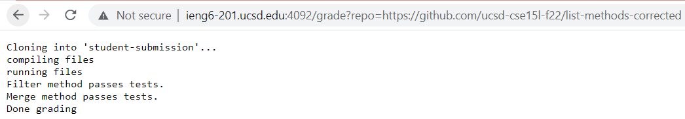

# Lab Report 5

    CPATH=".:lib/hamcrest-care-1.3.jar:lib/junit-4.13.2.jar"
    rm -rf student submission
    git clone $1 student-submission 2> cloning.txt
    cp TestListExamples.java student-submission/
    cp -r lib student-submission
    cd student-submission
    if [ ! -f "ListExamples.java" ]
    then
            echo "Unable to locate ListExamples.java, unable to grade."
            exit 1
    fi
    echo "compiling files"
    javac -cp $CPATH TestListExamples.java ListExamples.java
    if [ $? -ne 0 ]
    then
            echo "ListExamples.java did not compile"
            exit 1
    fi
    echo "running files"
    java -cp $CPATH org.junit.runner.JUnitCore TestListsExamples > results.txt 2> error.txt
    grep -q "Failure" results
    if [ $? -eq 0 ]
    then
            echo "All tests did not pass on this repository"
    fi
    grep -q "Filter" results.txt
    if [ $? -eq 0 ]
    then
            echo "All tests did not pass on this repository"
    else
            echo "Filter method passes tests."
    fi
    grep -q "Merge" results.txt
    if [ $? -eq 0 ]
    then
            echo "All tests did not pass on this repository"
    else
            echo "Merge method passes tests."
    fi
    echo "Done grading"

We will be using the above screenshot to trace what the code block above does on the repository in the image. The first line of the code are storing a long command into a variable. The second line is deleting the "student-submission" directory so it is newly created when we clone the given repository into "student-submission," there is no stdout, there is no standard error, and because this line did not cause an error the return code was zero. The third line of the code is cloning the given repository to the "student-submission." This line has no standard output, the stderr is the progress of cloning the repository to the given directory, and the return code is zero because it executed successfully. Next, "cp TestListExamples.java student-submission/" is copying the file with our tests into the "studnet-submission" directory. This line produces no other stdout, it also producess no stderr on this run of the code, and since it ran successfully the return code was zero. The line of code below that,"cp -r lib student-submission", is copying the etirety of the "lib" directory into the "student-submission" directory. There is no stdout for this line, there is not stderr for this line either, the return code was zero. Then, the line "cd student-submission" just changes the active directory of the bash script. dThis line has no stdout or stderr, and its return code was zero. The next line that runs is "if [ ! -f "ListExamples.java" ]," which is checking if the file "ListExamples.java" exists within our directory. This line has no stdout or stderr, and its return code is zero. Because the if statement was evaluated as true on this run of the code, we then run the "echo" command, which has an stdout of "Unable to locate ListExamples.java, unable to grade.", no stderr, and a return code of 0. The exit line of code underneath that has no stdout or stderr, and a return code of 1 because that is what was given. All lines of code below that do not run because the code stoped after the exit command, so everything below has no stdout, stderr, or a return code.
