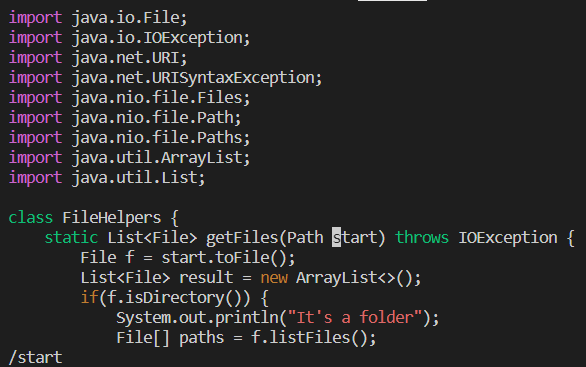
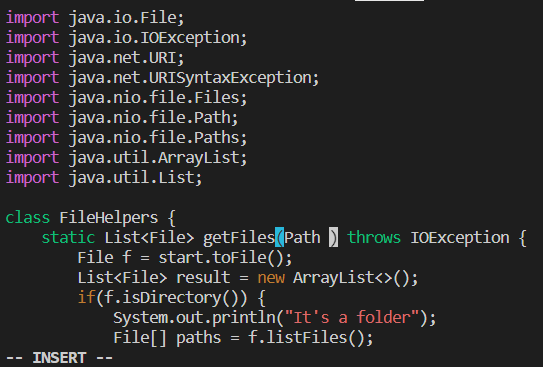
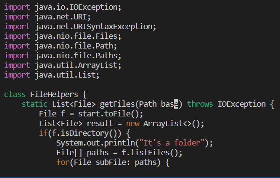
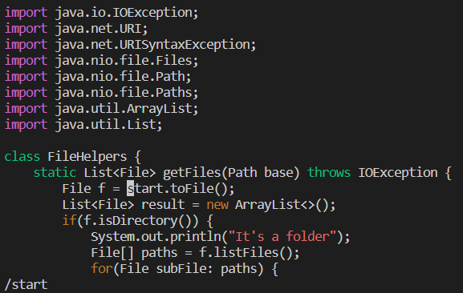
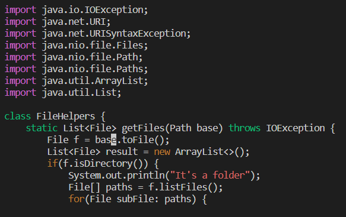
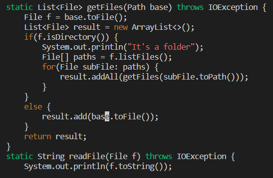
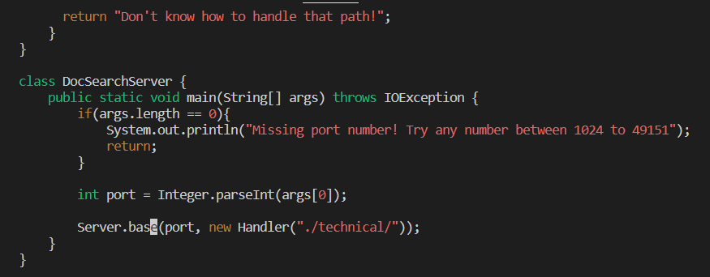
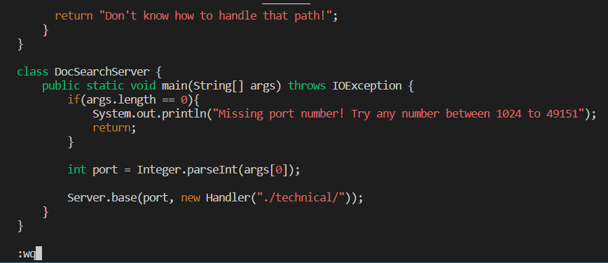
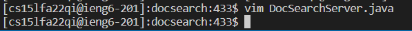

# Lab Report 4
## Part 1
We will be changing the name of the "start" parameter and its uses to "base" in the file DocSearchServer.java.

In order to actually do any changes though we need to use the command "vim DocSearchServer.java" to edit the file in the terminal.

All the keystrokes are here: **/start< Enter >cgnbase< esc >n.n.n.:wq< Enter >**

That's a lot to take in all at once so I will break it down piece by piece.

Once we are viewing the file in the terminal, now we will get into the first few key strokes. These are: **/start< Enter >**

This command will find the first appearance of the start parameter and pressing < Enter > will move the cursor to the begining of the apearance.

The next few key strokes we will analyze are: **cgn**

This command deletes the word we just searched for and then takes us from normal mode to insert mode so we can insert something. Then we get into the next few key strokes: **base< esc >**

Here, all we are doing is typing in what we want to replace "start" with, which is "base," and then pressing < esc > to get out of insert mode. Well, now that we've changed the first appearance of the parameter "start" with "base," now we have to do it for the rest of the file. This sounds like a lot of key strokes and will obviously add up to more than 30. Well, luckily we have cool short cuts that we redo all the work we just did to replace the first appearance of "start." We will cover the first of these, which is: **n**

**n** is especially useful here as it takes our previous search (which was /start) and takes us to the beginning its next appearance, as we can see from the image above. Then we press: **.**

The **.** just repeats our previous command of **cgnbase< esc >** and replaces "start" with base. Then we just rinse and repeat until we have no more appearances of "start." But let's keep going through our commands. Next we have: **n.**

To recap, all we did was find the next appearance of the "start" parameter with **n** command and then changed it to "base" using the **.** command. Then we will use these commands again.

Again, all we did was find an appearance of the "start" parameter with the **n** command and change it to "base" using the **.** command. Now, we have finished changing all appearances of "start" within DocSearchServer.java to "base." Now all we need to do is save our changes and exit the file. This is done by: **:wq< Enter >**

After entering the command you should be back at the terminal similar to what is shown below.

By my count, changed all appearanced of the "start" parameter to "base" in 25 key strokes
## Part 2
